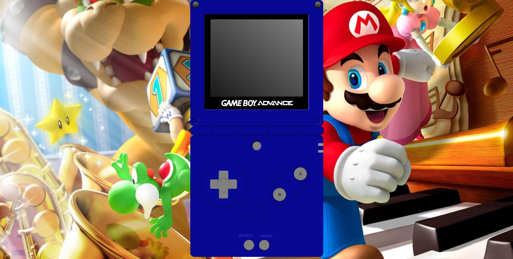
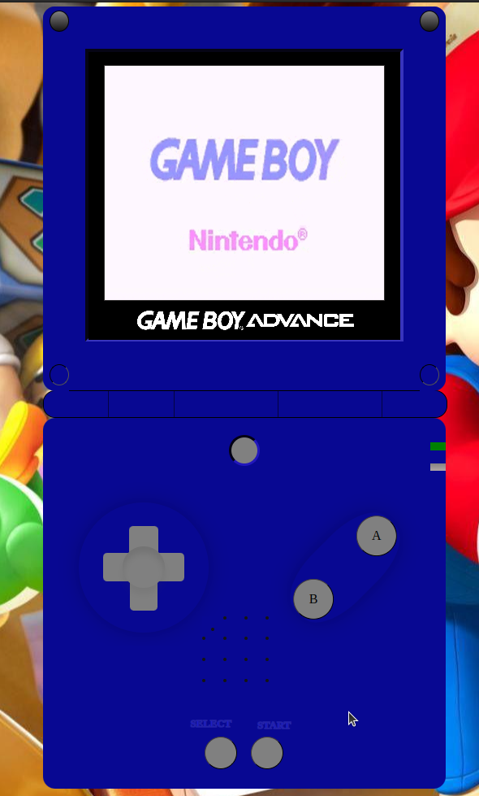
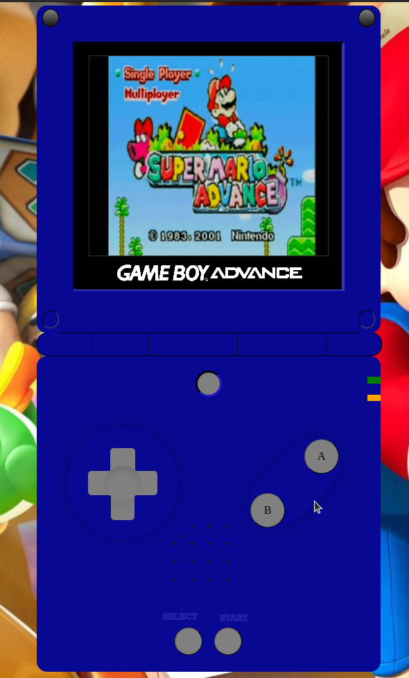
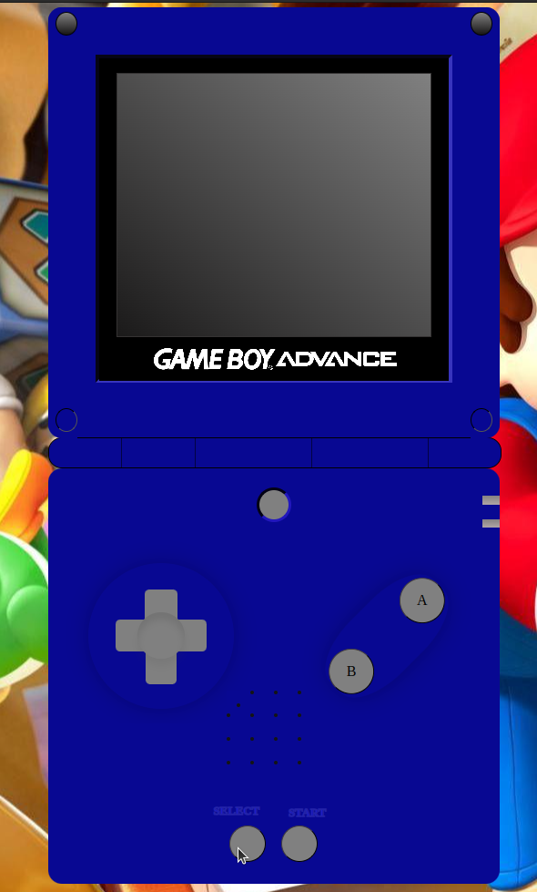

# Videoconsola  portatil Game boy Advance SP

La Game Boy Advance SP, frecuentemente abreviada como GBA SP, es una consola de videojuegos portátil fabricada por Nintendo y lanzada al mercado en marzo de 2003. Básicamente es un rediseño de la Game Boy Advance, con varias funciones añadidas como batería o pantalla iluminada. Es totalmente compatible con su antecesora.

Las siglas SP hacen referencia a "Special Project"​ (en español Proyecto Especial), término aclarado por Nintendo en su página web de atención al cliente. 
 

## Contenido

- [Introducción](#introducción)
- [Funcionamiento](#funcionamiento)
- [Tecnologías](#tecnologías-utilizadas)
- [Errores](#errores)
- [Licencia](#licencia)
 

## Introducción

En este proyecto se ha diseñado una Game Boy Advance SP y se le ha otorgado de funcionalidad algunos botones como: Select, Start y A.

## Funcionamiento

Pulsamos START, nos aparece la pantalla de bienvenida y se enciende el led verde, indicandonos que esta encendida.

 

Si pulsamos el boton A, se pondra en funcionamiento el juego Super Mario Bros y se encendera el led ambar, indicandonos que hay  cargado un juego.

 

Para apagar la videoconsola, pulsaremos SELECT.

 

 
 

## Tecnologías Utilizadas

 
 

## Errores

- En el archivo CSS, en la linea 30, aparece "*/", que al eliminarlo hace que el diseño de cajas se sobremonten unas encimas de otras, rompiendo todo el diseño.
 

## Licencia

Todo el contenido del repositorio se encuentra bajo licencia MIT. Las imágenes, son propiedad de Antonio Insa Benavent (https://www.linkedin.com/antonioinsa), este proyecto a sido desarroyado para la realización del bootcamp impartido por Geekshub academy en su XIX edicion.
